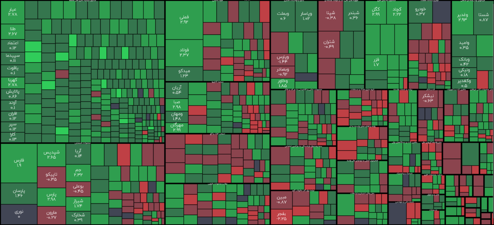

# Tahlil Negar Experimental Task

This repository contains the implementation for the **Tahlil Negar experimental task**, an interactive **market heat map** visualization for the **Iran Stock Exchange**, grouped by sectors and rendered with dynamic zoom and pan capabilities.

## Live Demo

You can view the deployed project here:  
👉 [Tahlil Negar Task Live Demo](https://ariarash44.github.io/tahlilNegar-task/)

## Technologies & Tools

- **Vanilla HTML, CSS, JavaScript:**  
  Core technologies used to build the interactive visualization without external frameworks.

- **Canvas API:**  
  Used for rendering the treemap and handling zoom, pan, and click interactions.

- **D3.js (Treemap):**  
  Provides hierarchical layout algorithms for squarified treemap rendering.

- **Vite:**  
  Bundler for fast development and optimized builds.

- **GitHub Pages:**  
  Deployment platform for hosting the live demo.

## Demo Previews

A visual overview of the heat map in different viewports:

| Mobile — View                                   | Desktop — View                                   |
|-------------------------------------------------|--------------------------------------------------|
|  |  |
| *mobile view of the heat map*                   | *Desktop view of the heat map*          |

## Features

- 📊 **Interactive Treemap:** Market data grouped by sectors, rendered as a squarified treemap.  
- 🔍 **Zoom & Pan:** Smooth zooming and panning with mouse wheel or touch gestures.  
- 🖱️ **Click Interaction:** Click on a stock rectangle to view details in a modal.  
- 📱 **Responsive Design:** Works across mobile and desktop viewports.  
- ⚡ **Fast Build & Deployment:** Powered by Vite and deployed via GitHub Pages.
